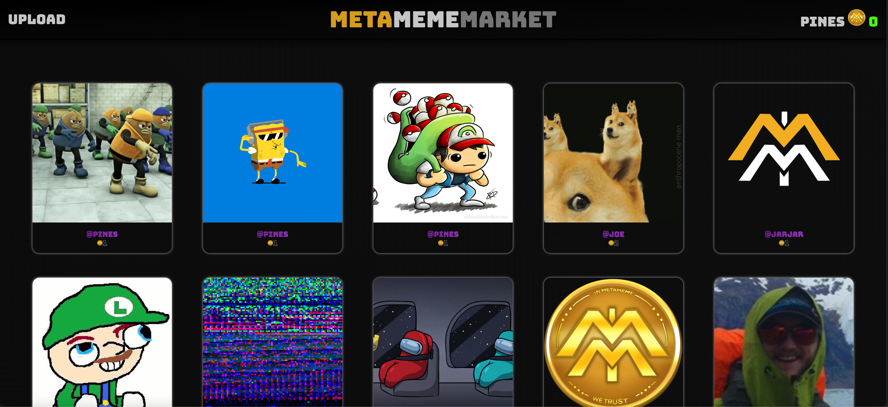
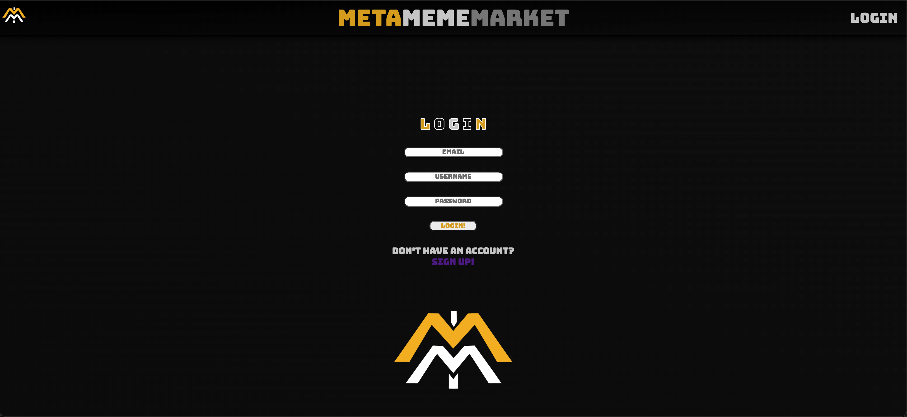
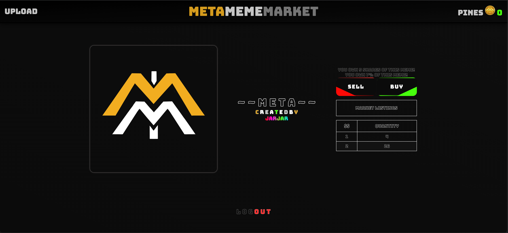
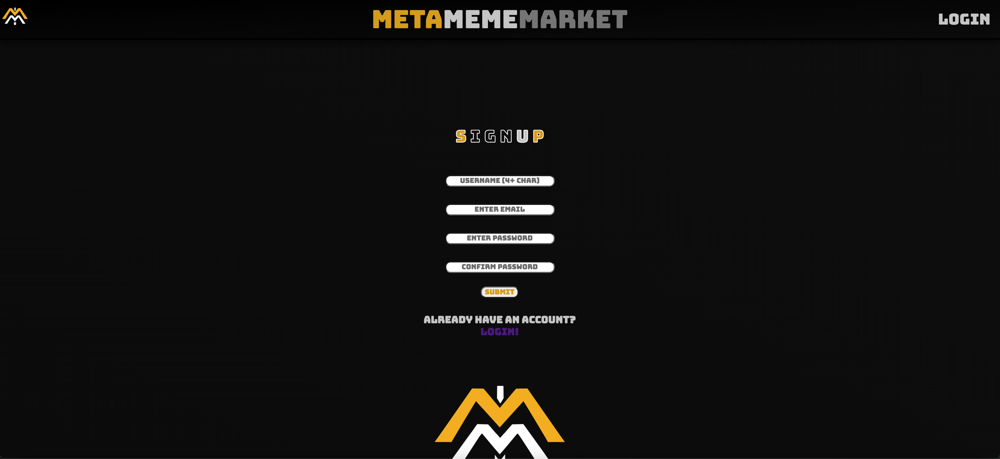
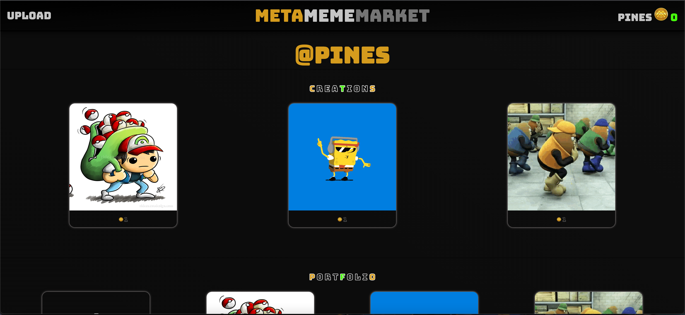

# MetaMemeMarket

GitHub: https://github.com/evanhosni/meta-meme-market

## Badges

## Description

Bringing crypto and memes together, creators now have the opportunity to allow investors to buy part, or all, of the ownership of memes they've created. By allowing investment, creators now have the opportunity to fund their hobbies or careers. 

On upload, the creator chooses how many shares to be offered and their initial price to be offered to the community. The creator will then receive half of the shares to ensure a minimum 50% control of the meme, but will be able to re-buy shares to increase their control, or sell a portion of their held shares for greater profit.

Users can, like the stock market, now invest in uploaded works by buying shares of content, either on the initial offering of shares, or taking advantage of the opportunity to buy shares other users have been put up for sale. Currently, as long as they're available, the initial offered shares will retain the creator set price. However, users can start selling their shares of a meme whenever they choose, even undercutting prices if so desired.

While many sites offer art auctions or investment, ours will have focus on stockmarket style of investing in memes specifically.

## Table of Contents

* [Installation](#installation)
* [Usage](#usage)
* [Credits](#credits)
* [Features](#features)
* [Contribute](#contribute)
* [Contact](#contact)

## Installation

No special installation directions required.

## Usage

## Credits

1. [Evan Hosni](https://github.com/evanhosni)

2. [Jared Hector](https://github.com/jwhector)

3. [Ryan Allen](https://github.com/Rallen4)

4. [David Abbey](https://github.com/davidabbey102)

## Features

BUY!!!! SELL!!!! CREATE!!!! OWN!!!!!

Using cloudinary to store uploaded files, post memes you create to allow others to view, and invest in your creations.

## License

This project is protected by MIT.

## Contact

Any questions or comments may be directed to us via our GitHub pages. (Linked in the credits section above.)

